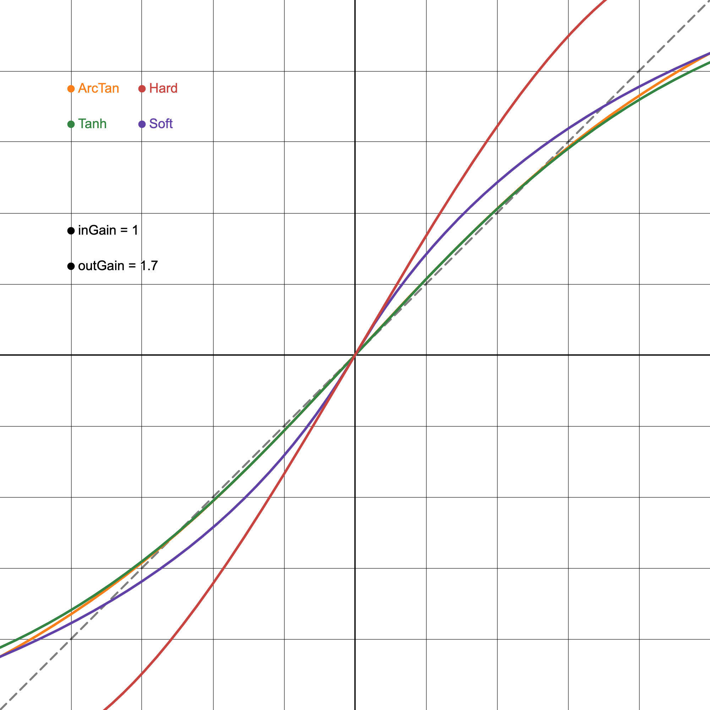
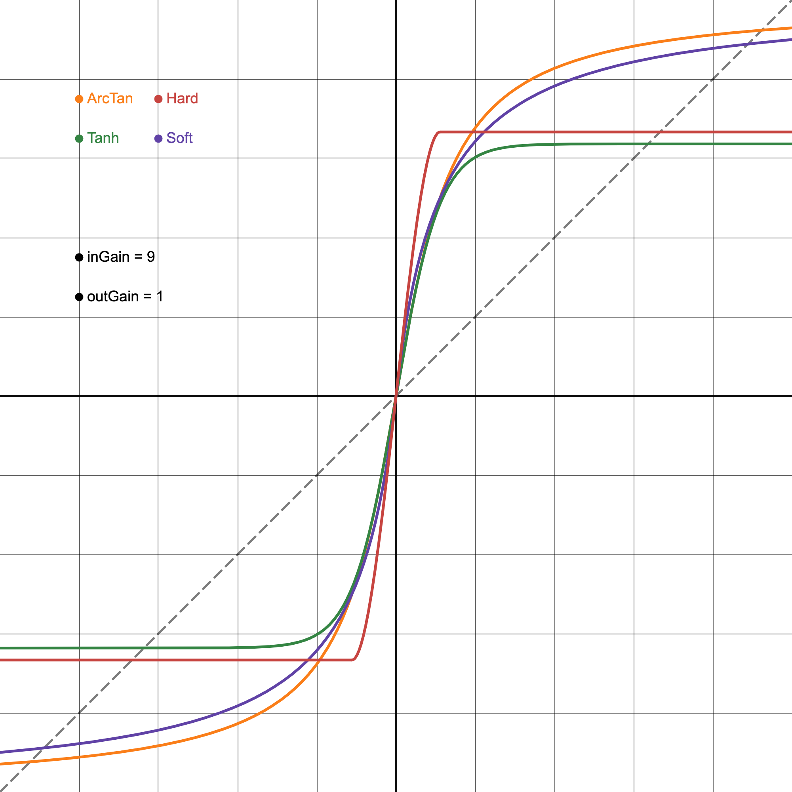

# Distortion

A set of processors providing various waveshaping/clipping algorithms for audio distortion and saturation effects.

Jump to each processor:
* [Waveshapers](#waveshaper)
* [Tube](#Tube)

## Waveshaper

The `Waveshaper` class implements four different waveshaping algorithms commonly used in audio processing for distortion, saturation, and harmonic enhancement. Each algorithm offers distinct sonic characteristics, from smooth soft clipping to aggressive hard clipping, although the sound depends mainly on how you combine these functions with other processors. Check out the following picture to see the visual representation of each waveshaper function:

Unity in/out gain    |  Output gain increased    | Input gain increased
:-------------------------:|:-------------------------:|:-------------------------:
  |   | 

### Features

- **Four waveshaping algorithms**: Soft Clipper, Hard Clipper, Tanh Clipper, and ArcTan Clipper. See the picture above to see a comparison of the different curves.
- **Flexible processing**: Process individual samples or entire audio buffers.
- **Configurable parameters**:
    - `inGain` modifies the waveshaper behaviour.
    - `outGain` is a utility parameter intended to be used for compensating the volume difference.
    - `param` is used in a parametric waveshaper (work in progress, not functional right now).
    - `bias` modifies the DC offset for asymmetric shaping (work in progress, not functional right now).

### Usage examples

```cpp
// --- PluginProcessor.h ---
#include "punk_dsp/punk_dsp.h"

class PluginProcessor : public juce::AudioProcessor
{
public:
    /* Your processor public stuff
     * ...
     */
private:
    /* Your processor public stuff
     * ...
     */
    punk_dsp::Waveshaper waveshaper;
};

// --- PluginProcessor.cpp ---
void PluginProcessor::updateParameters()
{
    // Your code...

    waveshaper.setInGain( newInGain );      // Make sure this values are in linear range
    waveshaper.setOutGain( newOutGain );    // Make sure this values are in linear range
    waveshaper.setParamFactor( newParam );  // Not working for now...
    waveshaper.setBiasFactor( newBias );    // Value between -1.0 and 1.0

    // Your code...
}

void PunkOTTProcessor::processBlock (juce::AudioBuffer<float>& buffer)
{
    // Sample application
    for (int channel = 0; channel < numChannels; ++channel)
    {
        float* channelData = inputBuffer.getWritePointer(channel);
        for (int sample = 0; sample < numSamples; ++sample)
            channelData[sample] = applySoftClipper(channelData[sample]);
            channelData[sample] = applyHardClipper(channelData[sample]);
            channelData[sample] = applyTanhClipper(channelData[sample]);
            channelData[sample] = applyATanClipper(channelData[sample]);
    }

    // Buffer application
    waveshaper.applySoftClipper(buffer);
    waveshaper.applyHardClipper(buffer);
    waveshaper.applyTanhClipper(buffer);
    waveshaper.applyATanClipper(buffer);
}
```

## Tube

Work in progress...

